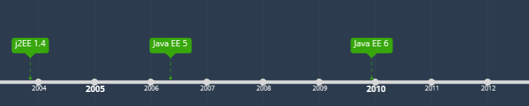
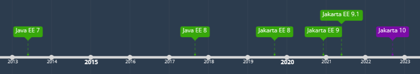
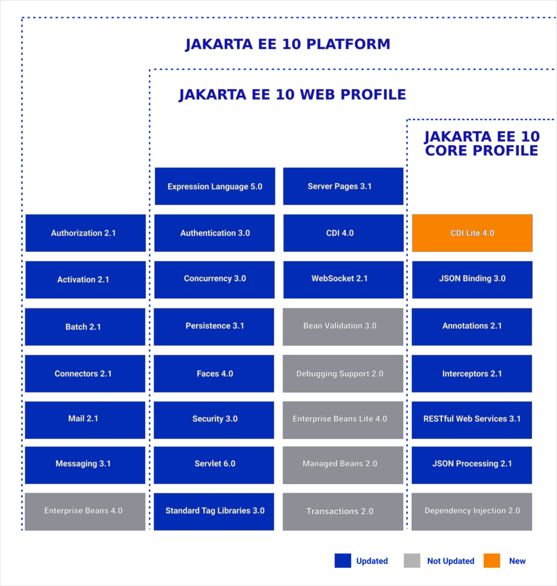
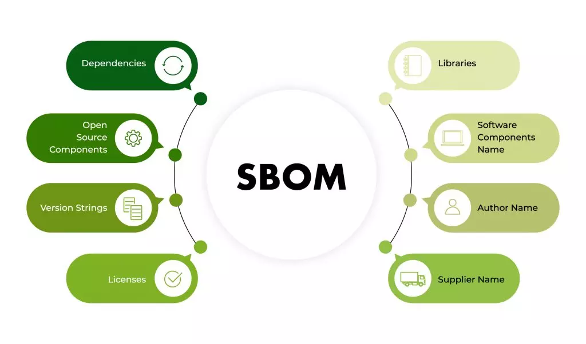
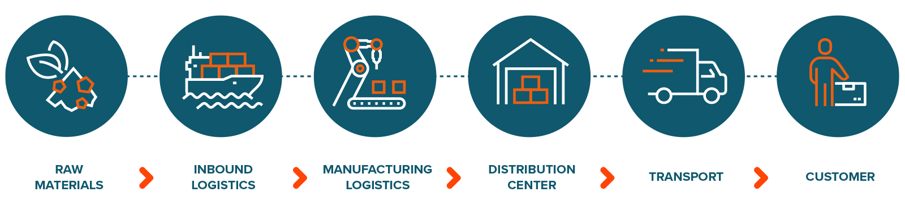
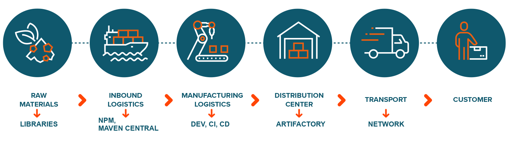
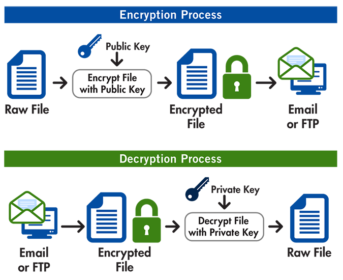
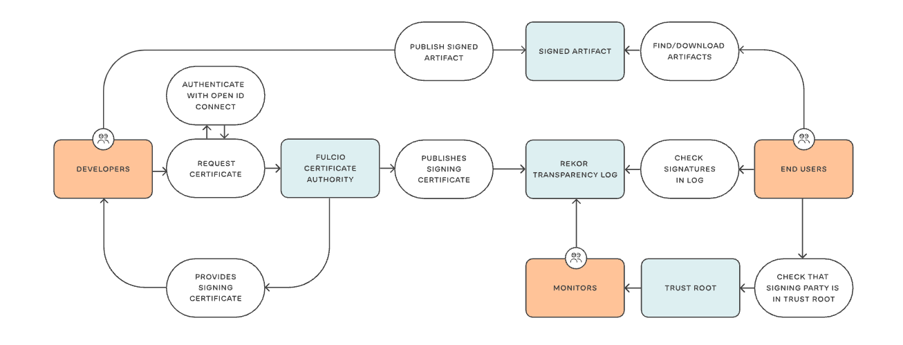

# Restitution JavaDay 2023 ☕

---
# JavaDay

- Évènement annuel organisé par le Paris JUG (2ème édition cette année)
- Conférences centrées autour de l'écosystème Java

---
# Java 21

---
# Jakarta EE 10

## Timeline

---
<!-- _footer: Jakarta EE 10 -->
## Components

* Jakarta Security
  - OpenID en standard
* Jakarta Persistence
  - UUID Type
* Jakarta RestFul WS
  - Multipart
* CDI Lite
  - Subset of CDI

<!-- 
Jakarta: Specifications, meaning that use these annotations as much as possible 

Core Profile: new minimal profile for microservices
-->
---
# GraalVM and Spring Boot Native

---
# CRaC vs GraalVM

- CRaC et GraalVM, même objectif : démarrage rapide
- Se passer de la "pré-chauffe" de la JVM :
    - JIT compilation
    - Analyse des annotations
    - Initialisation d'un contexte applicatif (Spring)

---
# CRaC vs GraalVM

- Checkpoint & restore : Faire une "snapshot" de la JVM après ce warm-up

- Démarrage en mode restore depuis le checkpoint : on passe cette phase de warm-up

- Permets de se passer des contraintes du natif (on travaille toujours avec une JVM)

---
# Supply Chain and SBOM

<!-- cf. Blackduck, dependencyTrack, etc. -->
---
<!-- _footer: Supply Chain and SBOM -->
# Supply Chain and SBOM

---
<!-- _footer: Supply Chain and SBOM -->
# Supply Chain and SBOM

<!-- Idée: faciliter la commercialisation, identification des defects, etc. -->
---
<!-- _footer: Supply Chain and SBOM -->
# PGP vs Sigstore

<!-- Echange de clé: chiant, contrainte: jamais perdre la clé privé -->
---
<!-- _footer: Supply Chain and SBOM -->
# PGP vs Sigstore

<!-- Signature "sans clés"
Fulcio: certificat a durée de vie limitée: 10m
Rekor: stocke les certifs dans un transparency log

Encore des problématiques a résoudre: Qui croire? 
Et reste toujours un "probleme": checker les signatures! -->
---
# Project Loom
